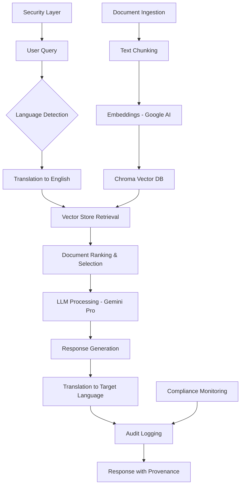

# Government Decision Support RAG System (Multilingual)

## 🏛️ Executive Summary

A comprehensive Retrieval-Augmented Generation (RAG) system designed specifically for local government decision-making with multilingual support (Sinhala, Tamil, English). This system prioritizes accuracy, transparency, compliance, and explainability in government AI applications.

## 🏗️ Architecture Overview



## 🔧 Component Breakdown

### 1. Document Ingestion
- **Supported formats**: PDF, TXT, CSV, Markdown
- **Enhanced metadata**: Document type, load timestamp, domain classification
- **Chunking strategy**: Recursive character splitter with 1200 char chunks, 300 char overlap

### 2. Vector Storage
- **Database**: Chroma (local deployment)
- **Embeddings**: Google AI embedding-001 model
- **Retrieval**: MMR (Maximum Marginal Relevance) for diverse results

### 3. LLM Processing
- **Model**: Google Gemini Pro
- **Temperature**: 0.1 (balanced accuracy and naturalness)
- **Prompt engineering**: Structured government-specific prompts

### 4. Translation Layer
- **Languages**: Sinhala, Tamil, English
- **Style**: Formal government communication
- **Bidirectional**: Query translation to English, response translation to target

### 5. Security & Compliance
- **Input sanitization**: XSS and injection prevention
- **Sensitive content detection**: Keywords and pattern matching
- **Audit logging**: Query tracking and response evaluation
- **Provenance requirements**: Source citation mandatory

## 🚀 Deployment Instructions

### Prerequisites
```bash
pip install streamlit langchain langchain-google-genai chromadb pypdf python-dotenv
```

### Environment Setup
1. Create `.env` file:
```env
GOOGLE_API_KEY=your_gemini_api_key_here
```

2. Create data directory and add government documents:
```bash
mkdir data
# Add your PDF, TXT, CSV files to the data/ directory
```

### Running the Application
```bash
# Standard version
streamlit run app_multilang.py

# Quota-managed version (recommended for production)
streamlit run app_quota_managed.py
```

**⚠️ API Quota Issues?** If you encounter "429 quota exceeded" errors, use the quota-managed version which includes local embedding fallbacks. See [QUOTA_MANAGEMENT_GUIDE.md](QUOTA_MANAGEMENT_GUIDE.md) for details.

## 📋 Prompt Strategy

### System Prompt Architecture
The system uses a comprehensive prompt template that includes:
- Domain-specific context (Local Government Planning)
- Compliance rules and guidelines
- Output structure requirements
- Provenance and citation standards
- Multilingual considerations

### Example Prompts

**Short-Answer Prompts:**
- "What are the current zoning regulations for commercial buildings?"
- "2025 වසරේ යටිතල පහසුකම් සඳහා අරමුදල් වෙන් කිරීම් කුමක්ද?" (Sinhala)
- "வணிக கட்டிடங்களுக்கான திட்டமிடல் விதிமுறைகள் என்ன?" (Tamil)

**Stepwise Reasoning Prompts:**
- "Analyze the environmental impact assessment requirements for new infrastructure projects"
- "Compare budget allocations across departments for fiscal year 2025"

## 📊 Evaluation & Monitoring

### Quality Metrics
- **Response Length**: Character count analysis
- **Source Coverage**: Number of documents referenced
- **Provenance Score**: Citation completeness
- **Compliance Check**: Hallucination detection keywords
- **Translation Accuracy**: Bidirectional consistency

### Audit Features
- **Query Logging**: Timestamped user interactions
- **Response Evaluation**: Automated quality scoring
- **Security Monitoring**: Sensitive content flagging
- **Performance Tracking**: Response time and accuracy metrics

### Monitoring Dashboard
Access via Streamlit sidebar:
- Document count and status
- Vector store health
- Query statistics
- Language distribution
- Error rates and compliance scores

## 🔒 Security & Privacy

### Data Protection
- Local vector storage (no cloud dependency)
- Query truncation in logs (privacy preservation)
- Input sanitization against injections
- Sensitive content detection and warnings

### Compliance Features
- Audit trail for all interactions
- Source document provenance
- Response accuracy validation
- Bias detection and mitigation

### Privacy Safeguards
- No personal data storage
- Anonymous session tracking
- Configurable logging levels
- Data retention policies

## 🔮 Future Enhancements

### Phase 1: Core Improvements
- **Hybrid Search**: Combine semantic and keyword search
- **Caching**: Redis for response caching
- **Performance**: Async processing and batch operations

### Phase 2: Advanced Features
- **Personalization**: User role-based responses
- **Advanced Analytics**: Query pattern analysis
- **Integration**: APIs for external system integration

### Phase 3: Scale & Intelligence
- **Multi-tenant**: Department-specific knowledge bases
- **Federated Search**: Cross-departmental queries
- **AI Governance**: Explainability and bias monitoring

## 🐳 Container Deployment

### Docker Configuration
```dockerfile
FROM python:3.9-slim

WORKDIR /app
COPY requirements.txt .
RUN pip install -r requirements.txt

COPY . .
EXPOSE 8501

CMD ["streamlit", "run", "app_multilang.py", "--server.port=8501", "--server.address=0.0.0.0"]
```

### Kubernetes Deployment
```yaml
apiVersion: apps/v1
kind: Deployment
metadata:
  name: gov-rag-system
spec:
  replicas: 2
  selector:
    matchLabels:
      app: gov-rag
  template:
    metadata:
      labels:
        app: gov-rag
    spec:
      containers:
      - name: gov-rag
        image: gov-rag:latest
        ports:
        - containerPort: 8501
        env:
        - name: GOOGLE_API_KEY
          valueFrom:
            secretKeyRef:
              name: api-keys
              key: google-api-key
```

## 🎯 Usage Examples

### English Query
```
Query: "What are the environmental compliance requirements for new construction projects?"
Response: Based on the Environmental Protection Guidelines (Doc: EPA_Guidelines_2024.pdf, Page 15)...
```

### Sinhala Query
```
Query: "නව ඉදිකිරීම් ව්‍යාපෘති සඳහා පරිසර අනුකූලතා අවශ්‍යතා මොනවාද?"
Response: 2024 පරිසර ආරක්ෂණ මාර්ගෝපදේශ අනුව (ලේඛනය: EPA_Guidelines_2024.pdf, පිටුව 15)...
```

### Tamil Query
```
Query: "புதிய கட்டுமான திட்டங்களுக்கான சுற்றுச்சூழல் இணக்க தேவைகள் என்ன?"
Response: 2024 சுற்றுச்சூழல் பாதுகாப்பு வழிகாட்டுதல்களின் படி (ஆவணம்: EPA_Guidelines_2024.pdf, பக்கம் 15)...
```

## 🤝 Contributing

### Code Standards
- Follow PEP 8 for Python code
- Include type hints for function parameters
- Add docstrings for all functions
- Implement comprehensive error handling

### Testing Guidelines
- Unit tests for all core functions
- Integration tests for RAG pipeline
- Security tests for input validation
- Performance tests for response times

### Documentation Requirements
- Update README for new features
- Include architecture diagrams
- Provide usage examples
- Document security considerations

## 📞 Support & Maintenance

### Troubleshooting
- Check Google API key configuration
- Verify document loading in data/ directory
- Monitor vector store building process
- Review audit logs for errors

### Performance Optimization
- Regular vector store rebuilding
- Document chunking parameter tuning
- LLM temperature adjustment
- Retrieval parameter optimization

### System Requirements
- **Minimum**: 8GB RAM, 4 CPU cores
- **Recommended**: 16GB RAM, 8 CPU cores
- **Storage**: 50GB for documents and vectors
- **Network**: Stable internet for Gemini API calls

---

**Version**: 2.0  
**Last Updated**: September 2025  
**License**: MIT  
**Contact**: Government IT Department
# Government Decision Support RAG System
